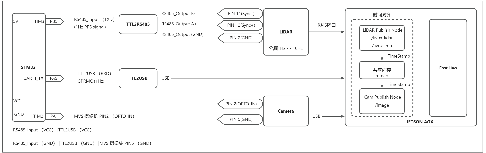

# LVI-SLAM 手持三维扫描仪

✍️

# 时间同步方案

# Markdown - Typora

✍️为工程代码写一份说明文档极其必要！

但是使用md文档，写说明时，难以实时预览所写工作，而且因为种种语法降低效率

推荐使用 vscode插件 **Typora**

[Github: Typora](https://github.com/cweijan/vscode-office)

# Acknowledgements🙏

感谢如下参考资料为我搭建设备提供的帮助！☺️

1. https://github.com/xuankuzcr/LIV_handhold
2. https://gitee.com/gwmunan/ros2/wikis
3. https://emoji.muan.co/

[2] Zheng, Chunran, et al. "FAST-LIVO: Fast and Tightly-coupled Sparse-Direct LiDAR-Inertial-Visual Odometry."

[1] Zheng, Chunran, et al. "FAST-LIVO2: Fast, Direct LiDAR-Inertial-Visual Odometry."
