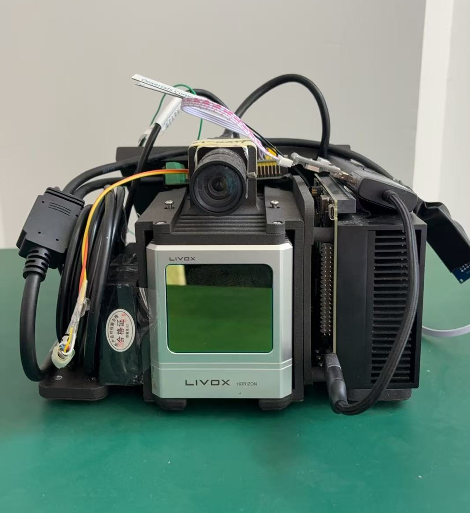
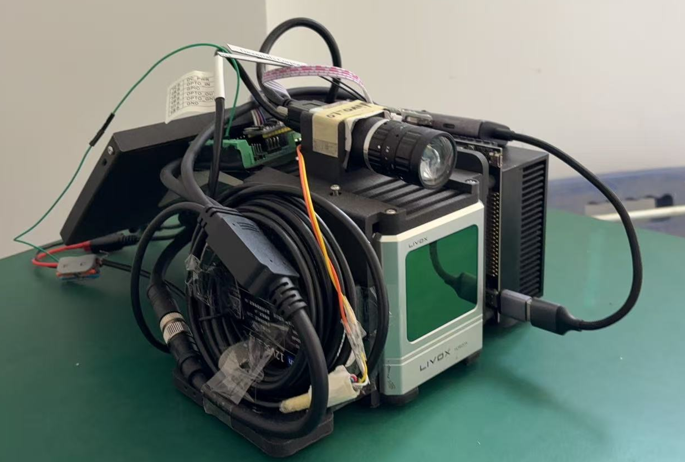

# LVI-SLAM 手持三维扫描仪

✍️

计划：

* [ ] 基本方案撰写
* [X] STM32程序代码 - 改进思路：主从定时器方案 + DMA发送数据
* [ ] 海康相机驱动代码
* [ ] 激光雷达驱动代码
* [ ] FAST-LIVO2代码
* [ ] 实验展示

# 项目概述

开发一台 基于激光雷达/相机/IMU 的手持 SLAM 设备 ，目的是满足三维空间下的地图重建、导航定位与算法开发需求

# 实物展示

正视图

侧视图

# 硬件方案

## 硬件清单

表格 硬件清单

## 硬件接口说明

思维导图接口说明

## 主控 - Jetson Xavier AGX

# 时空标定

## 相机内参标定

[camera_calibration - ROS Wiki](http://wiki.ros.org/camera_calibration)

ROS提供的一个用于单目或者双目相机标定的包，可以十分方便地使用。使用的标定板是棋盘格(Chessboard)，而非AprilTag。官网见这里。其实在官网上写了，这个包基于OpenCV实现，原理是一样的。在官网给出了利用它标定单目和双目相机的例子

## 相机 - lidar 外参标定

ref:

    [Fast-LIVO复现之联合标定 - Wiki - Gitee.com](https://gitee.com/gwmunan/ros2/wikis/%E5%AE%9E%E6%88%98%E6%95%99%E7%A8%8B/Fast-LIVO%E5%A4%8D%E7%8E%B0%E4%B9%8B%E8%81%94%E5%90%88%E6%A0%87%E5%AE%9A)

# 时间同步方案

# 软件方案

简要介绍三个代码的功能，具体说明见各代码内部md文件

FAST-LIVO2

激光雷达驱动 	[lidar_driver_readme.md](livox_ros_driver\lidar_driver_readme.md)

相机驱动        	[camera_driver_readme.md](mvs_ros_pkg\camera_driver_readme.md)

STM32驱动代码 [stm32_timersync-open\README.md](stm32_timersync-open\README.md)

# Markdown - Typora

✍️为工程代码写一份说明文档极其必要！

但是使用md文档，写说明时，难以实时预览所写工作，而且因为种种语法降低效率

推荐使用 vscode插件 **Typora**

[Github: Typora](https://github.com/cweijan/vscode-office)

# Acknowledgements🙏

感谢如下参考资料为我搭建设备提供的帮助！☺️

1. https://github.com/xuankuzcr/LIV_handhold
2. https://gitee.com/gwmunan/ros2/wikis
3. https://emoji.muan.co/

[2] Zheng, Chunran, et al. "FAST-LIVO: Fast and Tightly-coupled Sparse-Direct LiDAR-Inertial-Visual Odometry."

[1] Zheng, Chunran, et al. "FAST-LIVO2: Fast, Direct LiDAR-Inertial-Visual Odometry."
