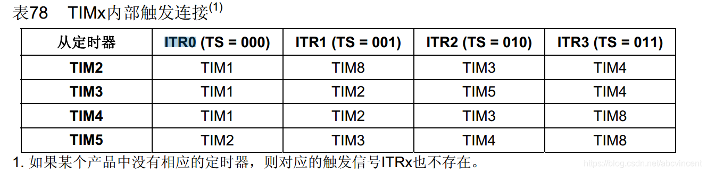
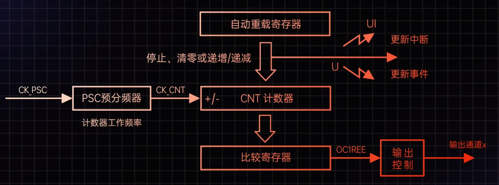

# STM32

思路：

1. 利用定时器PWM，生成1Hz和10Hz的PWM脉冲，用于触发激光雷达和相机采集数据，实现硬件时间同步
2. 利用定时器中断和UART串口发送1Hz自定义GPRMC数据，用于给定时间戳


# 问题

## 1 NVIC中断优先级分组的作用，以及分组2的具体含义

`NVIC_PriorityGroupConfig(NVIC_PriorityGroup_2); 	 //设置NVIC中断分组2:2位抢占优先级，2位响应优先级 `

NVIC分组决定了抢占优先级和子优先级的位数。分组2表示使用**2位抢占优先级和2位子优先级**，系统中可以有**4个不同的抢占等级**，每个等级有**4个子优先级**。

中断发生时，高抢占优先级的中断可以打断低抢占优先级的中断，而子优先级用于同一抢占优先级内的多个中断同时发生时的处理顺序

> 注：这里的2位表示，二进制位数，即00 01 10 11 可以表示0~3四个数
>
> 系统中定时器三设置为0抢占，3子优先级
>
> **分组2**：抢占优先级占高2位，子优先级占低2位
>
> 抢占优先级：数值越小，优先级越高；可以打断低抢占优先级的中断
>
> 子优先级：同一抢占优先级的中断，子优先级按顺序执行，不可打断
>
> STM32使用NVIC（嵌套中断向量控制器）管理中断优先级；分组方式由SCB->AIRCR寄存器的PRIGROUP决定，共有5组分组方式，0~4

## STM32F103C8T6型号配置

ref:[STM32F103C8T6单片机简介-CSDN博客](https://blog.csdn.net/fantastic_sky/article/details/110229474)

内核 Cortex-M3，主频最高72MHz，64k Flash，20K RAM

外设包括定时器，UART，SPI，I2C，ADC

系统时钟：内部8MHz时钟HSI最高可倍频64MHz，外部8MHz时钟HSE最高可倍频到72MHz

该芯片有哪些定时器，每个定时器对应的通道和可用的引脚

    TIM1是高级定时器，TIM2，3，4是通用定时器；定时器各有4各PWM通道；可用引脚可以查手册使用，支持重映射引脚，需要开启AFIO

    高级定时器TIM1特殊功能：支持互补输出（H桥驱动）、死区插入、紧急刹车，适用于电机控制

**型号命名规则：**


引脚排布以及复用：

[STM32F103C8T6芯片介绍-CSDN博客](https://blog.csdn.net/guguhen/article/details/140694021)


### 最小系统板

维持MCU正常工作的精简电路

最小系统一般由外部复位电路、外部时钟电路及MCU构成

另外最小系统板预留了SWD调试接口，使用ST-LINK下载程序和仿真

## 定时器多通道及控制电机

4个通道目的是支持多路独立的PWM信号输出

多路控制：单个定时器可同时控制多个设备

互补输出与死去控制：高级定时器TIM1 4个通道支持互补输出，用于驱动H桥电路，避免上下桥臂直通短路

* **TIM1_CH1**（主输出）和 **TIM1_CH1N**（互补输出）可控制一个电机桥臂。
* 4个通道可支持两路电机（每路电机需要两个互补通道）

频率一致：通过复用定时器的计数器和预分频器，4个通道共享同一时基，确保多路PWM信号的频率严格同步，简化控制逻辑

应用场景：

    电机控制：1个定时器的4通道可控制两个直流电机（每电机需两路信号，正反转）

```c
// 配置TIM1通道1和通道2为互补PWM输出
void TIM1_PWM_Init(uint16_t arr, uint16_t psc) {
    TIM_OCInitTypeDef TIM_OCInitStruct;
    TIM_BDTRInitTypeDef TIM_BDTRInitStruct;

    // 时基配置（频率设置）
    TIM_TimeBaseStructure.TIM_Period = arr;
    TIM_TimeBaseStructure.TIM_Prescaler = psc;
    TIM_TimeBaseInit(TIM1, &TIM_TimeBaseStructure);

    // PWM模式配置（通道1和通道2）
    TIM_OCInitStruct.TIM_OCMode = TIM_OCMode_PWM2;
    TIM_OCInitStruct.TIM_OutputState = TIM_OutputState_Enable;
    TIM_OCInitStruct.TIM_OCPolarity = TIM_OCPolarity_High;
    TIM_OC1Init(TIM1, &TIM_OCInitStruct); // 通道1
    TIM_OC2Init(TIM1, &TIM_OCInitStruct); // 通道2

    // 互补输出使能
    TIM_OC1NInit(TIM1, &TIM_OCInitStruct);
    TIM_OC2NInit(TIM1, &TIM_OCInitStruct);

    // 死区时间配置（防止上下桥臂直通）
    TIM_BDTRInitStruct.TIM_DeadTime = 0x10; // 约1.0μs（根据实际需求调整）
    TIM_BDTRInitStruct.TIM_Break = TIM_Break_Enable;
    TIM_BDTRConfig(TIM1, &TIM_BDTRInitStruct);

    // 启动定时器
    TIM_Cmd(TIM1, ENABLE);
    TIM_CtrlPWMOutputs(TIM1, ENABLE); // 必须调用此函数启动互补输出
}
```

控制逻辑：

设置互补通道的占空比实现正反转

正转：TIM_SetCompare1(TIM1, duty); TIM_SetCompare2(TIM1, 0);

反转：TIM_SetCompare1(TIM1, 0); TIM_SetCompare2(TIM1, duty);  调节占空比（`duty`值范围：0 ~ ARR）

**如何设置电机占空比：**

    占空比由比较寄存器（CCR）的值决定。例如，ARR=999，则CCR设置为500时，占空比为500/1000=50%

    TIM_SetCompare2(TIM3,TIM3->ARR/2);

**如何控制电机频率：**

    电机PWM频率一般设置为 5kHz ~ 20KHz

    电机频率由 主频72MHz/(arr +1)*(psc+1) 决定

**如何避免H桥上下管直通：**

    **死区时间插入**：通过TIMx_BDTR寄存器的 `TIM_DeadTime`配置死区时间（通常0.5μs~2μs）

**如何实现电机制动：**

    主动短路：将H桥上下管同时关闭，或者PWM占空比为0

**如何提高控制精度：**

    ARR值最大化：增大ARR可以提高占空比调节精度

**如何验证PWM输出正确：**

    一是使用示波器测量引脚波形，检查频率和占空比是否符合预期；二是利用调试查看ccr和arr寄存器的值

### 重映射引脚如何配置

开启AFIO时钟：`RCC_APB2PeriphClockCmd(RCC_APB2Periph_AFIO, ENABLE);`

调用重映射函数：`GPIO_PinRemapConfig(GPIO_PartialRemap_TIM3, ENABLE);`TIM3_CH2->PB5

指定引脚复用推挽输出：`GPIO_InitStructure.GPIO_Mode = GPIO_Mode_AF_PP;  //复用推挽输出`

部分重映射：部分通道重映射到新引脚

完全重映射：所有通道重映射到新引脚

## 定时器工作模式

1 基本定时中断模式

    配置arr，psc实现指定频率中断任务处理，任务函数写在在中断服务程序中执行

2 PWM模式

    生成指定频率的PWM脉冲信号，用于触发部件或者驱动电机

**为什么使用预装载？**

    预装载允许在更新事件（UEV）时同步更新ARR或CCR寄存器，避免写入过程中产生中间状态导致的波形抖动

APB1和APB2是两种外设总线，

    APB1是低速总线，最大时钟频率为36Mhz，时钟源由系统时钟（sysclk）分频得到（通过 RCC 配置，分频系数一般为 2, 4, 8 等）

    APB2是高速总线，最大时钟频率72Mhz，时钟源通常**直接使用系统时钟（SYSCLK）**

定时器首先配置到系统时钟源APB总线上，利用预分频寄存器，自动重装载寄存器以及计数器实现定时功能，若设置计数器模式为向上计数，当计数器增加到自动重装值ARR时，触发更新事件，并执行中断服务程序，重新计数

## 如何实现多路同步的PWM

使用主从定时器配置，通过 `TIM_TS_ITRx`触发从定时器

**PWM相位同步：**

    两路PWM信号上升沿在同一时刻对齐或者保持固定的相位差

**手动设置CNT方法：**

    1Hz的中断服务例程中（比如TIM3的中断），每次中断触发时（即1Hz的周期点），将TIM2的计数器设为ARR/2；这相当于在每次1Hz信号更新时，强制调整**10Hz信号的计数器起始点，从而使其相位与1Hz信号对齐**。这种方法的关键在于中断触发的时机是否准确，以及手动设置的计数器值是否能够精确对齐。

    优点：快捷方便实现相位一致的PWM脉冲，灵活调整相位偏移量

    缺点：中断延迟可能导致同步误差，强制改变计数器可能导致波形不连续

**主从定时器方法：**

    通过定时器的硬件级联或同步功能，使得一个定时器（从定时器）的计数周期触发另一个定时器（主定时器）的某些动作，例如复位或启动。例如，主定时器（1Hz）的更新事件可以触发从定时器（10Hz）的计数器复位，这样每次主定时器完成一个周期，从定时器就会重新开始计数，从而实现两者的同步。

### 主从定时器配置方法及原理

[多个定时器同步输出的主从配置示例 - STM32团队 ST意法半导体中文论坛 (stmicroelectronics.cn)](https://shequ.stmicroelectronics.cn/thread-622883-1-1.html)

在STM32F103系列微控制器中，定时器的级联（主从模式）通过**内部触发信号（ITRx）**实现，不同定时器的主从关系由硬件设计决定

**主定时器**：产生触发信号（如更新事件、比较匹配等），控制从定时器的行为

**从定时器**：接收主定时器的触发信号，执行复位、启动、停止或计数等操作

**触发信号类型**：STM32F103支持通过 **ITRx**（内部触发输入）连接定时器，具体映射由硬件决定



**主定时器触发输出模式：**

    主定时器触发输出源 TRGO

    TRGO可以通过以下事件产生：

* **更新事件（TIM_TRGOSource_Update）**：当计数器溢出/下溢时触发。
* **比较匹配（TIM_TRGOSource_OCxRef）**：当计数器与某个通道的比较寄存器（CCR）匹配时触发


**配置主定时器 TIM3 1Hz**

* 设置ARR和PSC，生成1Hz更新事件
* 配置TRGO为更新事件
*  **TIM3->CR2 |= TIM_TRGO_Update**;// 主定时器触发信号

**配置从定时器（TIM2，10Hz）**：

* 设置ARR和PSC，生成10Hz PWM
* 启用从模式，选择外部触发源（TIM3的TRGO）
* TIM2->SMCR |= TIM_SMCR_SMS_2;    // 从模式：外部触发复位
  TIM2->SMCR |= TIM_TS_ITR2;       // 触发源为TIM3的TRGO

**优点：硬件级同步**：无中断延迟，精度高。**波形连续性**：计数器自然复位，避免相位跳跃。


**PWM模式2下，1Hz的上升沿位置由CCR值决定**，若CCR设为ARR的一半（如5000），则上升沿在周期中间

主定时器

```c
// TIM3 初始化（1Hz，PWM模式2）
TIM_TimeBaseInitTypeDef TIM_TimeBaseStruct;
TIM_OCInitTypeDef TIM_OCInitStruct;

RCC_APB1PeriphClockCmd(RCC_APB1Periph_TIM3, ENABLE);

// 时基配置
TIM_TimeBaseStruct.TIM_Period =9999;// ARR = 9999
TIM_TimeBaseStruct.TIM_Prescaler =7199;// PSC = 7199 → 1Hz
TIM_TimeBaseStruct.TIM_CounterMode = TIM_CounterMode_Up;
TIM_TimeBaseInit(TIM3,&TIM_TimeBaseStruct);

// PWM模式2配置（通道2）
TIM_OCInitStruct.TIM_OCMode = TIM_OCMode_PWM2;
TIM_OCInitStruct.TIM_OutputState = TIM_OutputState_Enable;
TIM_OCInitStruct.TIM_Pulse =5000;// CCR2 = 5000（占空比50%）
TIM_OCInitStruct.TIM_OCPolarity = TIM_OCPolarity_High;// 有效电平为高
TIM_OC2Init(TIM3,&TIM_OCInitStruct);

// 主定时器触发输出（TRGO）配置为更新事件
TIM_SelectMasterSlaveMode(TIM3, TIM_MasterSlave_Enable);
TIM_SelectOutputTrigger(TIM3, TIM_TRGOSource_Update);

TIM_Cmd(TIM3, ENABLE);
```

从定时器

```c
// TIM2 初始化（10Hz，PWM模式2，从模式）
TIM_TimeBaseInitTypeDef TIM_TimeBaseStruct;
TIM_OCInitTypeDef TIM_OCInitStruct;

RCC_APB1PeriphClockCmd(RCC_APB1Periph_TIM2, ENABLE);

// 时基配置
TIM_TimeBaseStruct.TIM_Period =999;// ARR = 999 → 10Hz
TIM_TimeBaseStruct.TIM_Prescaler =7199;// PSC = 7199
TIM_TimeBaseStruct.TIM_CounterMode = TIM_CounterMode_Up;
TIM_TimeBaseInit(TIM2,&TIM_TimeBaseStruct);

// PWM模式2配置（通道2）
TIM_OCInitStruct.TIM_OCMode = TIM_OCMode_PWM2;
TIM_OCInitStruct.TIM_OutputState = TIM_OutputState_Enable;
TIM_OCInitStruct.TIM_Pulse =500;// CCR2 = 500（占空比50%）
TIM_OCInitStruct.TIM_OCPolarity = TIM_OCPolarity_High;// 有效电平为高
TIM_OC2Init(TIM2,&TIM_OCInitStruct);

// 从模式配置：TIM3的更新事件触发TIM2计数器复位
TIM_SelectSlaveMode(TIM2, TIM_SlaveMode_Reset);
TIM_SelectInputTrigger(TIM2, TIM_TS_ITR2);// TIM3为ITR2触发源

TIM_Cmd(TIM2, ENABLE
```


### PWM模式2下配置主从定时器 - 复位上升沿不一致

注意：

**PWM模式2不适合使用主从触发上升沿**

PWM模式2下，CNT>CCR，为有效电平，即高电平；那么上升沿在中间

在 **主从模式** 下，从定时器（TIM2）的计数器默认从 **0** 开始计数，而主定时器（TIM3）的计数器从 **0** 开始计数到 **ARR/2** 时触发上升沿。若直接使用主从模式复位TIM2的计数器，会导致 **TIM2的上升沿（CNT=ARR/2）与TIM3的上升沿（CNT=ARR/2）在时间上错位**，具体表现为：

* **TIM3（1Hz）**：上升沿在 `t=0.5秒`（CNT=5000）时触发。
* **TIM2（10Hz）**：每次TIM3触发时TIM2从0开始计数，其第一个上升沿在 `t=0.5秒 + 0.05秒 = 0.55秒`（CNT=500）时触发，未与TIM3对齐。

**TIM3（1Hz，主定时器）**：

* ARR = 9999，PSC = 7199 → 计数器频率 = 10kHz，周期1秒。
* CCR = 5000 → 上升沿在 `t=0.5秒`（CNT=5000）时触发

**TIM2（10Hz，从定时器）**：

* ARR = 999，PSC = 7199 → 计数器频率 = 10kHz，周期0.1秒。
* CCR = 500 → 上升沿在 `t=0.05秒`（CNT=500）时触发。
* **初始计数器值**：TIM2->CNT = 500 → 首次计数从500开始，触发后复位到500。

关键说明：

* **触发源选择**：
  将TIM3的触发源改为 `TIM_TRGOSource_OC2Ref`（比较匹配触发），而非更新事件（`TIM_TRGOSource_Update`）。这样TIM3的TRGO信号在其计数器达到CCR（5000）时产生，确保触发时刻与上升沿严格对齐。
* **从定时器初始相位**：
  通过手动设置 `TIM2->CNT = arr/2`，强制TIM2的计数器初始值为ARR/2，与TIM3的上升沿对齐。


**问题一：从定时器TIM2的初始值ARR/2与触发复位的关系**

**预装载寄存器**：在STM32中，定时器的自动重装载寄存器（ARR）和比较寄存器（CCR）支持预装载功能。当启用预装载时，**对寄存器的写操作会先写入预装载寄存器**，直到**发生更新事件（如计数器溢出）时，预装载寄存器的值才会被传输到活动寄存器**中

**复位模式（SlaveMode_Reset）**：当从定时器接收到主定时器的触发信号时，其计数器会被**硬件自动复位到0**，无论 `TIMx->CNT`的初始值如何

* 即使手动设置 `TIM2->CNT = ARR/2`，**当触发复位时，计数器仍会被强制清零**。
* 预装载寄存器的值（如ARR或CCR）会影响下一个周期的行为，**但触发复位的动作直接操作计数器，不涉及预装载机制**

**因此：PWM模式2不适合使用主从触发上升沿**

主触发TIM3

```
void TIM3_PWM_Init(u16 arr, u16 psc) {
    GPIO_InitTypeDef GPIO_InitStructure;
    TIM_TimeBaseInitTypeDef TIM_TimeBaseStructure;
    TIM_OCInitTypeDef TIM_OCInitStructure;
    NVIC_InitTypeDef NVIC_InitStructure;

    // 1. 使能时钟
    RCC_APB1PeriphClockCmd(RCC_APB1Periph_TIM3, ENABLE);
    RCC_APB2PeriphClockCmd(RCC_APB2Periph_GPIOB | RCC_APB2Periph_AFIO, ENABLE);
    GPIO_PinRemapConfig(GPIO_PartialRemap_TIM3, ENABLE);

    // 2. 配置GPIO
    GPIO_InitStructure.GPIO_Pin = GPIO_Pin_5;
    GPIO_InitStructure.GPIO_Mode = GPIO_Mode_AF_PP;
    GPIO_InitStructure.GPIO_Speed = GPIO_Speed_50MHz;
    GPIO_Init(GPIOB, &GPIO_InitStructure);

    // 3. 配置TIM3时基
    TIM_TimeBaseStructure.TIM_Period = arr;
    TIM_TimeBaseStructure.TIM_Prescaler = psc;
    TIM_TimeBaseStructure.TIM_ClockDivision = 0;
    TIM_TimeBaseStructure.TIM_CounterMode = TIM_CounterMode_Up;
    TIM_TimeBaseInit(TIM3, &TIM_TimeBaseStructure);

    // 4. 配置PWM模式
    TIM_OCInitStructure.TIM_OCMode = TIM_OCMode_PWM2;
    TIM_OCInitStructure.TIM_OutputState = TIM_OutputState_Enable;
    TIM_OCInitStructure.TIM_OCPolarity = TIM_OCPolarity_High;
    TIM_OC2Init(TIM3, &TIM_OCInitStructure);

    // 5. 配置为主定时器，触发源为更新事件
// TIM3 配置为 主模式，触发源为 TIM_TRGOSource_Update（更新事件触发TRGO）
    TIM_SelectMasterSlaveMode(TIM3, TIM_MasterSlave_Enable);
    // TIM_SelectOutputTrigger(TIM3, TIM_TRGOSource_Update); // 主模式触发TRGO
    // 关键修改：配置TIM3触发信号为比较匹配事件（CCR2触发）
    TIM_SelectOutputTrigger(TIM3, TIM_TRGOSource_OC2Ref); // 使用比较匹配触发TRGO

    // 6. 使能预装载和启动定时器
    TIM_OC2PreloadConfig(TIM3, TIM_OCPreload_Enable);
    TIM_ARRPreloadConfig(TIM3, ENABLE);
    TIM_Cmd(TIM3, ENABLE);

    // 7. 配置中断（仅用于生成GPS数据，不再手动同步TIM2）
    TIM_ITConfig(TIM3, TIM_IT_Update, ENABLE);
    NVIC_InitStructure.NVIC_IRQChannel = TIM3_IRQn;
    NVIC_InitStructure.NVIC_IRQChannelPreemptionPriority = 0;
    NVIC_InitStructure.NVIC_IRQChannelSubPriority = 3;
    NVIC_InitStructure.NVIC_IRQChannelCmd = ENABLE;
    NVIC_Init(&NVIC_InitStructure);
}
```


从定时器TIM2

```
void TIM2_PWM_Init(u16 arr, u16 psc) {
    GPIO_InitTypeDef GPIO_InitStructure;
    TIM_TimeBaseInitTypeDef TIM_TimeBaseStructure;
    TIM_OCInitTypeDef TIM_OCInitStructure;

    // 1. 使能时钟
    RCC_APB1PeriphClockCmd(RCC_APB1Periph_TIM2, ENABLE);
    RCC_APB2PeriphClockCmd(RCC_APB2Periph_GPIOA, ENABLE);

    // 2. 配置GPIO
    GPIO_InitStructure.GPIO_Pin = GPIO_Pin_1;
    GPIO_InitStructure.GPIO_Mode = GPIO_Mode_AF_PP;
    GPIO_InitStructure.GPIO_Speed = GPIO_Speed_50MHz;
    GPIO_Init(GPIOA, &GPIO_InitStructure);

    // 3. 配置TIM2时基
    TIM_TimeBaseStructure.TIM_Period = arr;
    TIM_TimeBaseStructure.TIM_Prescaler = psc;
    TIM_TimeBaseStructure.TIM_ClockDivision = 0;
    TIM_TimeBaseStructure.TIM_CounterMode = TIM_CounterMode_Up;
    TIM_TimeBaseInit(TIM2, &TIM_TimeBaseStructure);

    // 4. 配置为从定时器，触发源为TIM3的ITR2

    // 关键修改：配置TIM2初始计数器为ARR/2，并启用预装载
    TIM2->CNT = arr / 2; // 初始计数器设为ARR/2（相位偏移）

   // 确保TIM3的TRGO通过ITR2连接到TIM2
   // TIM2 配置为 从模式，触发源为 TIM_TS_ITR2（对应TIM3的触发信号），从模式为 SlaveMode_Reset（触发时复位计数器）
    TIM_SelectInputTrigger(TIM2, TIM_TS_ITR2);      // 触发源为TIM3
    TIM_SelectSlaveMode(TIM2, TIM_SlaveMode_Reset); // 触发时复位计数器

    // 5. 配置PWM模式
    TIM_OCInitStructure.TIM_OCMode = TIM_OCMode_PWM2;
    TIM_OCInitStructure.TIM_OutputState = TIM_OutputState_Enable;
    TIM_OCInitStructure.TIM_OCPolarity = TIM_OCPolarity_High;
    TIM_OC2Init(TIM2, &TIM_OCInitStructure);

    // 6. 使能预装载和启动定时器
    TIM_OC2PreloadConfig(TIM2, TIM_OCPreload_Enable);
    TIM_ARRPreloadConfig(TIM2, ENABLE);
    TIM_Cmd(TIM2, ENABLE);

    // 7. 设置初始占空比
    TIM_SetCompare2(TIM2, TIM2->ARR / 2);
}
```


### PWM模式1下的主从定时器配置

**1 PWM模式1的基本行为**

* **上升沿触发条件**：在PWM模式1（`TIM_OCMode_PWM1`）下，当计数器 **从ARR值溢出归零时**，输出变为有效电平（如高电平），形成上升沿。CNT<=CCR 有效电平
* **下降沿触发条件**：当计数器达到比较寄存器（CCR）值时，输出变为无效电平（如低电平）

**2 主从定时器同步原理**

* **主定时器（TIM3）**：配置为1Hz PWM模式1，溢出时触发更新事件（`TRGO`）。
* **从定时器（TIM2）**：配置为从模式，接收主定时器的触发信号，复位计数器并启动，确保其上升沿与主定时器同步。

主定时器3 PWM1

```c
voidTIM3_PWM_Init(u16 arr, u16 psc){
    GPIO_InitTypeDef GPIO_InitStructure;
    TIM_TimeBaseInitTypeDef TIM_TimeBaseStructure;
    TIM_OCInitTypeDef TIM_OCInitStructure;
    NVIC_InitTypeDef NVIC_InitStructure;

// 1. 使能时钟
RCC_APB1PeriphClockCmd(RCC_APB1Periph_TIM3, ENABLE);
RCC_APB2PeriphClockCmd(RCC_APB2Periph_GPIOB | RCC_APB2Periph_AFIO, ENABLE);
GPIO_PinRemapConfig(GPIO_PartialRemap_TIM3, ENABLE);// 部分重映射TIM3_CH2到PB5

// 2. 配置GPIO
    GPIO_InitStructure.GPIO_Pin = GPIO_Pin_5;
    GPIO_InitStructure.GPIO_Mode = GPIO_Mode_AF_PP;
    GPIO_InitStructure.GPIO_Speed = GPIO_Speed_50MHz;
GPIO_Init(GPIOB,&GPIO_InitStructure);

// 3. 配置时基（ARR=9999, PSC=7199 → 1Hz）
    TIM_TimeBaseStructure.TIM_Period = arr;
    TIM_TimeBaseStructure.TIM_Prescaler = psc;
    TIM_TimeBaseStructure.TIM_ClockDivision =0;
    TIM_TimeBaseStructure.TIM_CounterMode = TIM_CounterMode_Up;
TIM_TimeBaseInit(TIM3,&TIM_TimeBaseStructure);

// 4. 配置PWM模式1，CCR=5000（占空比50%）
    TIM_OCInitStructure.TIM_OCMode = TIM_OCMode_PWM1;
    TIM_OCInitStructure.TIM_OutputState = TIM_OutputState_Enable;
    TIM_OCInitStructure.TIM_OCPolarity = TIM_OCPolarity_High;
    TIM_OCInitStructure.TIM_Pulse =5000;// CCR值
TIM_OC2Init(TIM3,&TIM_OCInitStructure);

// 5. 配置主模式：更新事件触发TRGO
TIM_SelectMasterSlaveMode(TIM3, TIM_MasterSlave_Enable);
TIM_SelectOutputTrigger(TIM3, TIM_TRGOSource_Update);

// 6. 启用预装载和启动定时器
TIM_OC2PreloadConfig(TIM3, TIM_OCPreload_Enable);
TIM_ARRPreloadConfig(TIM3, ENABLE);
TIM_Cmd(TIM3, ENABLE);

// 7. 配置中断（可选，用于其他功能）
TIM_ITConfig(TIM3, TIM_IT_Update, ENABLE);
    NVIC_InitStructure.NVIC_IRQChannel = TIM3_IRQn;
    NVIC_InitStructure.NVIC_IRQChannelPreemptionPriority =0;
    NVIC_InitStructure.NVIC_IRQChannelSubPriority =3;
    NVIC_InitStructure.NVIC_IRQChannelCmd = ENABLE;
NVIC_Init(&NVIC_InitStructure);
}
```


```c
voidTIM2_PWM_Init(u16 arr, u16 psc){
    GPIO_InitTypeDef GPIO_InitStructure;
    TIM_TimeBaseInitTypeDef TIM_TimeBaseStructure;
    TIM_OCInitTypeDef TIM_OCInitStructure;

// 1. 使能时钟
RCC_APB1PeriphClockCmd(RCC_APB1Periph_TIM2, ENABLE);
RCC_APB2PeriphClockCmd(RCC_APB2Periph_GPIOA, ENABLE);

// 2. 配置GPIO
    GPIO_InitStructure.GPIO_Pin = GPIO_Pin_1;
    GPIO_InitStructure.GPIO_Mode = GPIO_Mode_AF_PP;
    GPIO_InitStructure.GPIO_Speed = GPIO_Speed_50MHz;
GPIO_Init(GPIOA,&GPIO_InitStructure);

// 3. 配置时基（ARR=999, PSC=7199 → 10Hz）
    TIM_TimeBaseStructure.TIM_Period = arr;
    TIM_TimeBaseStructure.TIM_Prescaler = psc;
    TIM_TimeBaseStructure.TIM_ClockDivision =0;
    TIM_TimeBaseStructure.TIM_CounterMode = TIM_CounterMode_Up;
TIM_TimeBaseInit(TIM2,&TIM_TimeBaseStructure);

// 4. 配置为从模式：触发源为TIM3的TRGO（ITR2）
TIM_SelectInputTrigger(TIM2, TIM_TS_ITR2);// ITR2对应TIM3
TIM_SelectSlaveMode(TIM2, TIM_SlaveMode_Reset);// 触发时复位计数器到0

// 5. 配置PWM模式1，CCR=500（占空比50%）
    TIM_OCInitStructure.TIM_OCMode = TIM_OCMode_PWM1;
    TIM_OCInitStructure.TIM_OutputState = TIM_OutputState_Enable;
    TIM_OCInitStructure.TIM_OCPolarity = TIM_OCPolarity_High;
    TIM_OCInitStructure.TIM_Pulse =500;// CCR值
TIM_OC2Init(TIM2,&TIM_OCInitStructure);

// 6. 启用预装载和启动定时器
TIM_OC2PreloadConfig(TIM2, TIM_OCPreload_Enable);
TIM_ARRPreloadConfig(TIM2, ENABLE);
TIM_Cmd(TIM2, ENABLE);
}
```


总结：

在 **PWM模式1** 下，通过配置主从定时器的硬件同步机制，可以实现两路PWM信号的上升沿严格对齐。主定时器TIM3在溢出时触发从定时器TIM2的复位，使得两者的上升沿在计数器归零时自然对齐，无需手动干预计数器值。初始状态下，只要CCR > 0，输出即为高电平，确保初始上升沿的正确性。

## 定时器产生PWM原理

PWM脉冲宽度调制，改变脉冲的时间宽度，来等效获得相应幅值和频率的波形

STM32上，将PWM功能集成在定时器电路上 

基本原理是在基本定时器电路上，增加了比较寄存器CCR，以及一个输出控制电路，输出波形

比较寄存器CCR作用是，将计数器的值与设定值比较，将比较结果传出给输出控制电路，时期输出对应的电平信号

例如设置PWM输出模式为2，当CNT>CCR，电平输出有效；所以比较寄存器作用是调节PWM高低电平的占空比





## UART发送字符串

printf 重定向到 fputc


## UART 改 DMA基本概念

中断服务程序里直接调用printf来发送数据，因为printf通常是阻塞的，会导致中断处理时间过长，影响系统实时性

DMA来替代这种阻塞式的发送方式，这样可以在数据传输时不占用CPU资源，提高效率

**DMA（直接存储器访问）允许外设直接和内存进行数据传输**，无需CPU介入。这对于大量数据传输非常有用，比如UART发送大量数据时，可以显著减少CPU负担

**1. 理解DMA的基本原理**

* **DMA（Direct Memory Access）**：允许外设（如UART）直接与内存交换数据，无需CPU参与。
* **优势**：减少CPU负载，适合高频、大数据量传输（如GPS数据持续发送）。
* **关键概念**：
  * **传输方向**：内存到外设（发送）或外设到内存（接收）。
  * **传输模式**：单次传输、循环传输。
  * **中断**：传输完成时触发中断通知CPU

**2. 硬件与库函数依赖**

* **硬件**：STM32F103系列（支持DMA1通道4用于USART1_TX）
* **库函数**：标准外设库（如 `stm32f10x_dma.h`、`stm32f10x_usart.h`

**3. 配置DMA发送的步骤**

**(1) 初始化DMA通道**

```c
#include "stm32f10x_dma.h"

void USART1_DMA_Init(void) {
    DMA_InitTypeDef DMA_InitStructure;

    // 1. 使能DMA时钟
    RCC_AHBPeriphClockCmd(RCC_AHBPeriph_DMA1, ENABLE);

    // 2. 配置DMA通道4（USART1_TX对应DMA1通道4）
    DMA_DeInit(DMA1_Channel4); // 复位DMA通道

    DMA_InitStructure.DMA_PeripheralBaseAddr = (uint32_t)&USART1->DR; // 外设地址（USART数据寄存器）
    DMA_InitStructure.DMA_MemoryBaseAddr = (uint32_t)tx_buffer;        // 内存地址（发送缓冲区）
    DMA_InitStructure.DMA_DIR = DMA_DIR_PeripheralDST;                 // 传输方向：内存→外设
    DMA_InitStructure.DMA_BufferSize = 0;                              // 传输数据长度（动态设置）
    DMA_InitStructure.DMA_PeripheralInc = DMA_PeripheralInc_Disable;   // 外设地址不递增
    DMA_InitStructure.DMA_MemoryInc = DMA_MemoryInc_Enable;            // 内存地址递增
    DMA_InitStructure.DMA_PeripheralDataSize = DMA_PeripheralDataSize_Byte; // 外设数据宽度：8位
    DMA_InitStructure.DMA_MemoryDataSize = DMA_MemoryDataSize_Byte;          // 内存数据宽度：8位
    DMA_InitStructure.DMA_Mode = DMA_Mode_Normal;                      // 单次传输模式
    DMA_InitStructure.DMA_Priority = DMA_Priority_High;                // 高优先级
    DMA_InitStructure.DMA_M2M = DMA_M2M_Disable;                       // 禁用内存到内存模式
    DMA_Init(DMA1_Channel4, &DMA_InitStructure);

    // 3. 使能DMA通道
    DMA_Cmd(DMA1_Channel4, ENABLE);
}
```

**2) 修改UART初始化代码（启用DMA支持）**

```c
#include"stm32f10x_usart.h"

voidUSART1_Init(void){
    USART_InitTypeDef USART_InitStructure;

// 原有UART初始化代码（波特率、数据位等）
    USART_InitStructure.USART_BaudRate =9600;
    USART_InitStructure.USART_WordLength = USART_WordLength_8b;
    USART_InitStructure.USART_StopBits = USART_StopBits_1;
    USART_InitStructure.USART_Parity = USART_Parity_No;
    USART_InitStructure.USART_HardwareFlowControl = USART_HardwareFlowControl_None;
    USART_InitStructure.USART_Mode = USART_Mode_Tx;
USART_Init(USART1,&USART_InitStructure);

// 启用UART的DMA发送功能
USART_DMACmd(USART1, USART_DMAReq_Tx, ENABLE);

// 使能UART
USART_Cmd(USART1, ENABLE);
}
```


**(3) 替换 `printf`为DMA发送函数**

```
// 定义发送缓冲区
#define TX_BUFFER_SIZE 128
volatile uint8_t tx_buffer[TX_BUFFER_SIZE];
volatile uint8_t dma_busy = 0; // DMA传输状态标志

void USART1_SendByDMA(uint8_t *data, uint16_t len) {
    // 等待上一次DMA传输完成
    while (dma_busy);

    // 检查数据长度是否合法
    if (len > TX_BUFFER_SIZE) len = TX_BUFFER_SIZE;

    // 复制数据到发送缓冲区
    memcpy((void*)tx_buffer, data, len);

    // 配置DMA传输参数
    DMA1_Channel4->CNDTR = len; // 设置传输数据长度
    DMA1_Channel4->CMAR = (uint32_t)tx_buffer; // 内存地址
    DMA1_Channel4->CPAR = (uint32_t)&USART1->DR; // 外设地址

    // 启动DMA传输
    dma_busy = 1;
    DMA_Cmd(DMA1_Channel4, ENABLE);
}

// 在中断服务程序中调用DMA发送
void TIM3_IRQHandler(void) {
    if (TIM_GetITStatus(TIM3, TIM_IT_Update) != RESET) {
        // ...（原有代码：更新时间、生成NMEA语句）

        // 替换printf为DMA发送
        uint16_t len = strlen(value_2) + 2; // 计算总长度（数据 + 校验和）
        USART1_SendByDMA((uint8_t*)value_2, len);
    }
}
```


**4) 处理DMA传输完成中断**

```

// 在stm32f10x_it.c中添加DMA中断处理函数
void DMA1_Channel4_IRQHandler(void) {
    if (DMA_GetITStatus(DMA1_IT_TC4)) {
        // 清除中断标志
        DMA_ClearITPendingBit(DMA1_IT_TC4);

        // 标记DMA空闲
        dma_busy = 0;

        // 可选：关闭DMA通道（单次传输模式需手动关闭）
        DMA_Cmd(DMA1_Channel4, DISABLE);
    }
}

// 在main()中启用DMA中断
int main(void) {
    // ...其他初始化代码

    // 配置DMA中断优先级
    NVIC_InitTypeDef NVIC_InitStructure;
    NVIC_InitStructure.NVIC_IRQChannel = DMA1_Channel4_IRQn;
    NVIC_InitStructure.NVIC_IRQChannelPreemptionPriority = 1;
    NVIC_InitStructure.NVIC_IRQChannelSubPriority = 1;
    NVIC_InitStructure.NVIC_IRQChannelCmd = ENABLE;
    NVIC_Init(&NVIC_InitStructure);

    // 使能DMA传输完成中断
    DMA_ITConfig(DMA1_Channel4, DMA_IT_TC, ENABLE);

    while(1);
}
```


| **代码段**               | **功能说明**                                      |
| ------------------------------ | ------------------------------------------------------- |
| `USART1_DMA_Init()`          | 配置DMA通道4，关联USART1_TX，设置传输方向为内存到外设。 |
| `USART1_Init()`              | 启用UART的DMA发送功能，使能USART1。                     |
| `USART1_SendByDMA()`         | 将数据复制到发送缓冲区，配置DMA参数并启动传输。         |
| `DMA1_Channel4_IRQHandler()` | DMA传输完成中断处理函数，清除标志并更新状态。           |


## 异或校验和

**步骤一：解释异或运算（XOR）**
异或是一种二进制运算，其规则如下：

* 0 XOR 0 = 0
* 0 XOR 1 = 1
* 1 XOR 0 = 1
* 1 XOR 1 = 0

相同为0，不相同为1

**步骤二：异或校验和的基本概念**
异或校验和是通过对数据流中所有字节按位进行异或运算得到的结果。具体步骤通常是：

1. 初始化一个变量（通常为0）。
2. **遍历数据中的每个字节，依次与这个变量进行异或运算**。
3. 最终得到的变量值即为校验和。

例如，对于数据"ABC"，其ASCII码分别是65、66、67。计算异或校验和：
65 XOR 66 = 00000001 (1)
1 XOR 67 = 01000010 (66)
所以校验和为66（十六进制0x42）。

在NMEA协议中，**异或校验和**的计算仅针对数据中的 **字符本身**（ASCII码），而不是对度分格式的数值进行数学运算

## NMEA协议

该协议定义了GNSS数据传输方式

**每条语句以 `$` 开头，以 `*` 和校验和结尾**

**GPRMC**（Recommended Minimum Specific GNSS Data）是NMEA协议中最常用的语句之一，提供定位、时间、速度等核心信息

`$GPRMC,<1>,<2>,<3>,<4>,<5>,<6>,<7>,<8>,<9>,<10>,<11>,<12>*<校验和>`

| 1  | UTC时间        | 格式为 `hhmmss.ss`（小时分钟秒.毫秒），例如 `123519.00` 表示12:35:19。   |
| -- | -------------- | ---------------------------------------------------------------------------- |
| 2  | 状态           | `A`=有效定位，`V`=无效定位。                                             |
| 3  | 纬度           | 格式为 `ddmm.mmmm`（度分.分的小数），例如 `4916.45` 表示49度16.45分。    |
| 4  | 纬度方向       | `N`（北纬）或 `S`（南纬）。                                              |
| 5  | 经度           | 格式为 `dddmm.mmmm`（度分.分的小数），例如 `12311.12` 表示123度11.12分。 |
| 6  | 经度方向       | `E`（东经）或 `W`（西经）。                                              |
| 7  | 地面速率（节） | 1节=1.852公里/小时。                                                         |
| 8  | 地面航向       | 相对于真北的角度（0°~359.9°）。                                            |
| 9  | UTC日期        | 格式为 `ddmmyy`（日月年），例如 `230520` 表示2020年5月23日。             |
| 10 | 磁偏角         | 磁北与真北的偏差角度（可选）。                                               |
| 11 | 磁偏角方向     | `E`（东）或 `W`（西）（可选）。                                          |
| 12 | 模式指示       | `A`=自主定位，`D`=差分定位，`N`=无效（可选）。                         |


**GPGGA**（Global Positioning System Fix Data）是NMEA协议中描述 **详细定位信息** 的语句，常用于GPS接收器输出的高精度定位数据，包含时间、经纬度、海拔高度、卫星数量、定位质量等核心信息。

**与GPRMC的区别**：

* **GPRMC**：提供 **最小推荐定位数据**（时间、位置、速度、日期）。
* **GGA**：提供 **详细定位参数**（卫星数量、海拔、定位质量等）

```
$GPGGA,<1>,<2>,<3>,<4>,<5>,<6>,<7>,<8>,<9>,<10>,<11>,<12>,<13>,<14>*<校验和>
```


| 1  | **UTC时间**              | 格式为 `hhmmss.ss`（小时分钟秒.毫秒），例如 `082543.00` 表示08:25:43。      |
| -- | ------------------------------ | ------------------------------------------------------------------------------- |
| 2  | **纬度**                 | 格式为 `ddmm.mmmm`（度分.分的小数），例如 `3142.4462` 表示31°42.4462'。    |
| 3  | **纬度方向**             | `N`（北纬）或 `S`（南纬）。                                                 |
| 4  | **经度**                 | 格式为 `dddmm.mmmm`（度分.分的小数），例如 `12127.3528` 表示121°27.3528'。 |
| 5  | **经度方向**             | `E`（东经）或 `W`（西经）。                                                 |
| 6  | **定位质量指示**         | `0`=无效，`1`=GPS定位，`2`=差分GPS定位，`6`=估算值。                    |
| 7  | **使用的卫星数量**       | 当前用于定位的卫星数（0~12）。                                                  |
| 8  | **水平精度因子（HDOP）** | 数值越小精度越高（例如 `1.2` 表示高精度）。                                   |
| 9  | **海拔高度**             | 单位：米（例如 `36.9` 表示海拔36.9米）。                                      |
| 10 | **海拔单位**             | `M`（米）。                                                                   |
| 11 | **大地水准面高度**       | 相对于椭球面的高度（单位：米，可选）。                                          |
| 12 | **大地水准面单位**       | `M`（米）。                                                                   |
| 13 | **差分数据年龄（秒）**   | 最后一次差分GPS更新的时间（若无差分则为空）。                                   |
| 14 | **差分参考站ID**         | 差分基准站编号（若无则为空）。                                                  |


## GPIO模式

**输入**

    浮空：引脚不连接内部上拉或下拉电阻，电平由外部电路决定

    上拉：内部连接上拉电阻（默认高电平），外部无信号时保持高电平；**按键检测（按键按下时接地，引脚拉低**

    下拉：内部连接下拉电阻（默认低电平），外部无信号时保持低电平

**输出**

    开漏：仅NMOS管驱动，高电平需外部上拉电阻提供；高电平由外部上拉电阻决定，低电平由NMOS拉低。适合总线通信（如I2C、单总线），避免电平冲突

    推挽：使用MOS管驱动，可主动输出高电平或低电平；驱动能力强（高电平由VDD提供，低电平由GND吸收）

```plaintext
VDD → PMOS → 引脚  
引脚 → NMOS → GND
```

    复用：引脚连接到内部外设（如UART、SPI、PWM等），由外设控制信号；

* 串口通信（USART_TX/USART_RX）。
* PWM输出（TIMx_CHx）。
* I2C通信（SDA/SCL）

    模拟：关闭数字电路，引脚直接连接到ADC/DAC模块；采集模拟信号（如温度传感器、光敏电阻）；输出模拟信号（如DAC生成波形）


| **浮空输入** | 外部明确驱动的数字信号（如外部上拉按键） | `GPIO_Mode_IN_FLOATING` |
| ------------------ | ---------------------------------------- | ------------------------- |
| **上拉输入** | 检测低电平触发信号（如按键按下接地）     | `GPIO_Mode_IPU`         |
| **下拉输入** | 检测高电平触发信号（如传感器高电平输出） | `GPIO_Mode_IPD`         |
| **推挽输出** | 驱动LED、蜂鸣器、继电器等负载            | `GPIO_Mode_Out_PP`      |
| **开漏输出** | I2C总线、单总线（需外接上拉电阻）        | `GPIO_Mode_Out_OD`      |
| **复用推挽** | UART发送（TX）、SPI主设备通信            | `GPIO_Mode_AF_PP`       |
| **开漏复用** | I2C通信（SDA/SCL）                       | `GPIO_Mode_AF_OD`       |
| **模拟模式** | ADC输入、DAC输出                         | `GPIO_Mode_AIN`         |

**输出速度（Output Speed）**：控制引脚电平切换速度，影响功耗和EMI（电磁干扰）；低速（2MHz）、中速（10MHz）、高速（50MHz）；


**代码实例：**

```
// 配置PA5为推挽输出（驱动LED）
GPIO_InitTypeDef GPIO_InitStruct = {0};
GPIO_InitStruct.Pin = GPIO_Pin_5;
GPIO_InitStruct.Mode = GPIO_Mode_Out_PP;      // 推挽输出
GPIO_InitStruct.Speed = GPIO_Speed_50MHz;     // 高速模式
HAL_GPIO_Init(GPIOA, &GPIO_InitStruct);

// 配置PB6为I2C1_SCL（开漏复用模式）
GPIO_InitStruct.Pin = GPIO_Pin_6;
GPIO_InitStruct.Mode = GPIO_Mode_AF_OD;       // 开漏复用
GPIO_InitStruct.Pull = GPIO_NOPULL;           // 禁用上下拉
GPIO_InitStruct.Speed = GPIO_Speed_50MHz;
GPIO_InitStruct.Alternate = GPIO_AF4_I2C1;   // 复用为I2C1功能
HAL_GPIO_Init(GPIOB, &GPIO_InitStruct);
```


**为什么I2C必须用开漏模式？**

* 避免总线冲突，**多个设备可共享同一总线，任一设备拉低总线即可实现“线与”逻辑**
