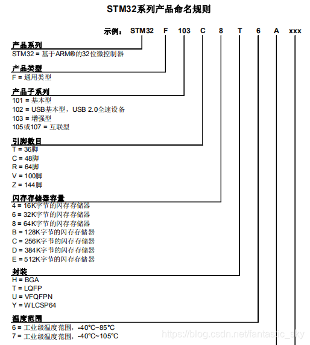
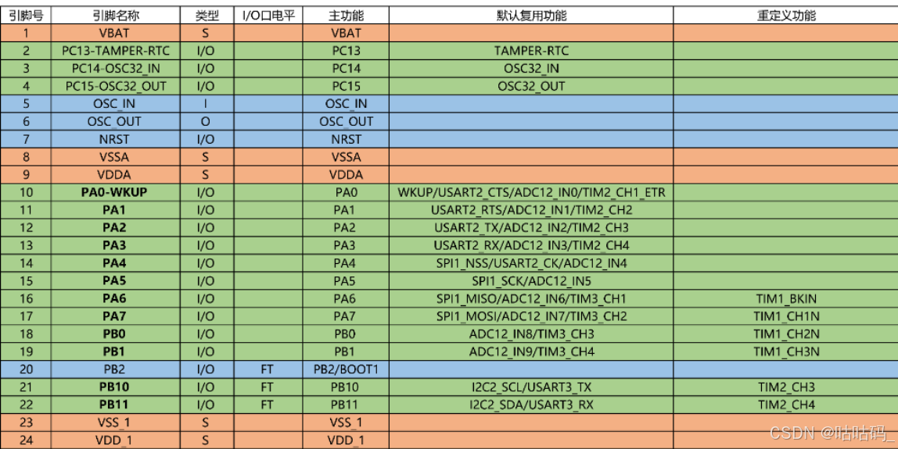
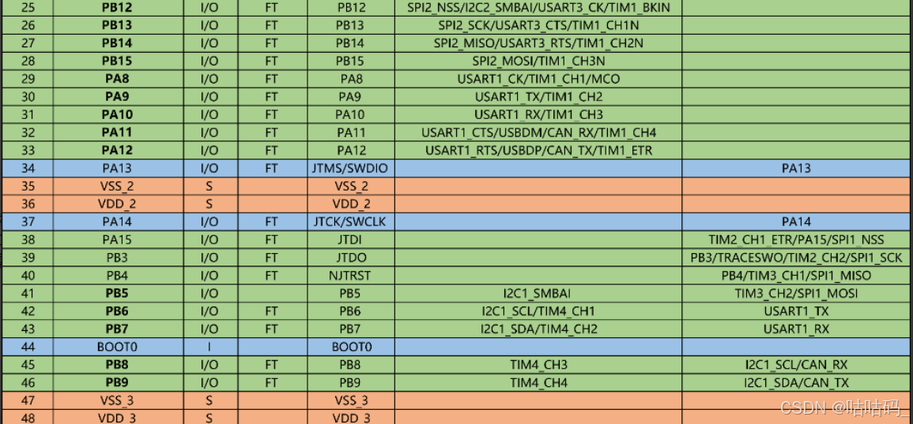

# STM32

# 问题

## 1 NVIC中断优先级分组的作用，以及分组2的具体含义

`NVIC_PriorityGroupConfig(NVIC_PriorityGroup_2); 	 //设置NVIC中断分组2:2位抢占优先级，2位响应优先级 `

NVIC分组决定了抢占优先级和子优先级的位数。分组2表示使用**2位抢占优先级和2位子优先级**，系统中可以有**4个不同的抢占等级**，每个等级有**4个子优先级**。

中断发生时，高抢占优先级的中断可以打断低抢占优先级的中断，而子优先级用于同一抢占优先级内的多个中断同时发生时的处理顺序

> 注：这里的2位表示，二进制位数，即00 01 10 11 可以表示0~3四个数
>
> 系统中定时器三设置为0抢占，3子优先级
>
> **分组2**：抢占优先级占高2位，子优先级占低2位
>
> 抢占优先级：数值越小，优先级越高；可以打断低抢占优先级的中断
>
> 子优先级：同一抢占优先级的中断，子优先级按顺序执行，不可打断
>
> STM32使用NVIC（嵌套中断向量控制器）管理中断优先级；分组方式由SCB->AIRCR寄存器的PRIGROUP决定，共有5组分组方式，0~4

## STM32F103C8T6型号配置

ref:[STM32F103C8T6单片机简介-CSDN博客](https://blog.csdn.net/fantastic_sky/article/details/110229474)

内核 Cortex-M3，主频最高72MHz，64k Flash，20K RAM

外设包括定时器，UART，SPI，I2C，ADC

系统时钟：内部8MHz时钟HSI最高可倍频64MHz，外部8MHz时钟HSE最高可倍频到72MHz

该芯片有哪些定时器，每个定时器对应的通道和可用的引脚

    TIM1是高级定时器，TIM2，3，4是通用定时器；定时器各有4各PWM通道；可用引脚可以查手册使用，支持重映射引脚，需要开启AFIO

    高级定时器TIM1特殊功能：支持互补输出（H桥驱动）、死区插入、紧急刹车，适用于电机控制

**型号命名规则：**



引脚排布以及复用：

[STM32F103C8T6芯片介绍-CSDN博客](https://blog.csdn.net/guguhen/article/details/140694021)





### 最小系统板

维持MCU正常工作的精简电路

最小系统一般由外部复位电路、外部时钟电路及MCU构成

另外最小系统板预留了SWD调试接口，使用ST-LINK下载程序和仿真

## 定时器多通道及控制电机

4个通道目的是支持多路独立的PWM信号输出

多路控制：单个定时器可同时控制多个设备

互补输出与死去控制：高级定时器TIM1 4个通道支持互补输出，用于驱动H桥电路，避免上下桥臂直通短路

* **TIM1_CH1**（主输出）和 **TIM1_CH1N**（互补输出）可控制一个电机桥臂。
* 4个通道可支持两路电机（每路电机需要两个互补通道）

频率一致：通过复用定时器的计数器和预分频器，4个通道共享同一时基，确保多路PWM信号的频率严格同步，简化控制逻辑

应用场景：

    电机控制：1个定时器的4通道可控制两个直流电机（每电机需两路信号，正反转）

```c
// 配置TIM1通道1和通道2为互补PWM输出
void TIM1_PWM_Init(uint16_t arr, uint16_t psc) {
    TIM_OCInitTypeDef TIM_OCInitStruct;
    TIM_BDTRInitTypeDef TIM_BDTRInitStruct;

    // 时基配置（频率设置）
    TIM_TimeBaseStructure.TIM_Period = arr;
    TIM_TimeBaseStructure.TIM_Prescaler = psc;
    TIM_TimeBaseInit(TIM1, &TIM_TimeBaseStructure);

    // PWM模式配置（通道1和通道2）
    TIM_OCInitStruct.TIM_OCMode = TIM_OCMode_PWM2;
    TIM_OCInitStruct.TIM_OutputState = TIM_OutputState_Enable;
    TIM_OCInitStruct.TIM_OCPolarity = TIM_OCPolarity_High;
    TIM_OC1Init(TIM1, &TIM_OCInitStruct); // 通道1
    TIM_OC2Init(TIM1, &TIM_OCInitStruct); // 通道2

    // 互补输出使能
    TIM_OC1NInit(TIM1, &TIM_OCInitStruct);
    TIM_OC2NInit(TIM1, &TIM_OCInitStruct);

    // 死区时间配置（防止上下桥臂直通）
    TIM_BDTRInitStruct.TIM_DeadTime = 0x10; // 约1.0μs（根据实际需求调整）
    TIM_BDTRInitStruct.TIM_Break = TIM_Break_Enable;
    TIM_BDTRConfig(TIM1, &TIM_BDTRInitStruct);

    // 启动定时器
    TIM_Cmd(TIM1, ENABLE);
    TIM_CtrlPWMOutputs(TIM1, ENABLE); // 必须调用此函数启动互补输出
}
```

控制逻辑：

设置互补通道的占空比实现正反转

正转：TIM_SetCompare1(TIM1, duty); TIM_SetCompare2(TIM1, 0);

反转：TIM_SetCompare1(TIM1, 0); TIM_SetCompare2(TIM1, duty);  调节占空比（`duty`值范围：0 ~ ARR）

**如何设置电机占空比：**

    占空比由比较寄存器（CCR）的值决定。例如，ARR=999，则CCR设置为500时，占空比为500/1000=50%

    TIM_SetCompare2(TIM3,TIM3->ARR/2);

**如何控制电机频率：**

    电机PWM频率一般设置为 5kHz ~ 20KHz

    电机频率由 主频72MHz/(arr +1)*(psc+1) 决定

**如何避免H桥上下管直通：**

    **死区时间插入**：通过TIMx_BDTR寄存器的 `TIM_DeadTime`配置死区时间（通常0.5μs~2μs）

**如何实现电机制动：**

    主动短路：将H桥上下管同时关闭，或者PWM占空比为0

**如何提高控制精度：**

    ARR值最大化：增大ARR可以提高占空比调节精度

**如何验证PWM输出正确：**

    一是使用示波器测量引脚波形，检查频率和占空比是否符合预期；二是利用调试查看ccr和arr寄存器的值

### 重映射引脚如何配置

开启AFIO时钟：`RCC_APB2PeriphClockCmd(RCC_APB2Periph_AFIO, ENABLE);`

调用重映射函数：`GPIO_PinRemapConfig(GPIO_PartialRemap_TIM3, ENABLE);`TIM3_CH2->PB5

指定引脚复用推挽输出：`GPIO_InitStructure.GPIO_Mode = GPIO_Mode_AF_PP;  //复用推挽输出`

部分重映射：部分通道重映射到新引脚

完全重映射：所有通道重映射到新引脚

## 定时器工作模式

1 基本定时中断模式

    配置arr，psc实现指定频率中断任务处理，任务函数写在在中断服务程序中执行

2 PWM模式

    生成指定频率的PWM脉冲信号，用于触发部件或者驱动电机

**为什么使用预装载？**

    预装载允许在更新事件（UEV）时同步更新ARR或CCR寄存器，避免写入过程中产生中间状态导致的波形抖动

## 如何实现多路同步的PWM

使用主从定时器配置，通过 `TIM_TS_ITRx`触发从定时器


**PWM相位同步：**

    两路PWM信号上升沿在同一时刻对齐或者保持固定的相位差

手动设置CNT方法：

    1Hz的中断服务例程中（比如TIM3的中断），每次中断触发时（即1Hz的周期点），将TIM2的计数器设为ARR/2；这相当于在每次1Hz信号更新时，强制调整10Hz信号的计数器起始点，从而使其相位与1Hz信号对齐。这种方法的关键在于中断触发的时机是否准确，以及手动设置的计数器值是否能够精确对齐。

主从定时器方法：

    通过定时器的硬件级联或同步功能，使得一个定时器（从定时器）的计数周期触发另一个定时器（主定时器）的某些动作，例如复位或启动。例如，主定时器（1Hz）的更新事件可以触发从定时器（10Hz）的计数器复位，这样每次主定时器完成一个周期，从定时器就会重新开始计数，从而实现两者的同步。

## TC264型号配置

## DMA直接通信

## GPIO输出模式

开漏

推挽
